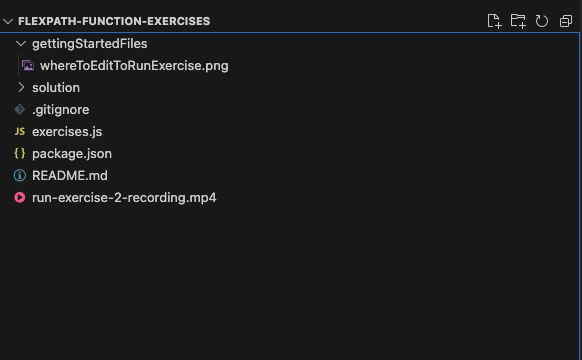
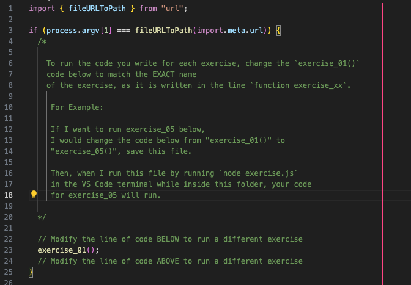

# flexpath-function-exercises

## Exercise overview

The intention of this exercise is to give you more experience writing functions
in JavaScript.

## Getting Started

1. Using Visual Studio Code, open the folder `flexpath-function-exercises` 
   wherever you saved it on your device. 
2. Your VS code file explorer window should look like this:
   
3. Then open up the `exercises.js` file in the `flexpath-function-exercises` folder. 
   Inside of this file we have provided exercises for you to complete, written 
   in code comments. For each exercise, please code ONLY in the space 
   between the comments `// CODE IN THE OPEN LINES BELOW` and `// CODE IN THE OPEN LINES ABOVE` 
4. To run your code for different exercises, you will update the exercise mentioned
   on line 23 of the file. 
   
5. After changing that line, make sure to SAVE the file before running it.
6. To run your code in exercises.js, you will update line 23 to run the exercise code
   you want to run and save the file. THEN, open a Terminal window in VS Code 
   by going to your toolbar at the top of the page and selecting 
   "Terminal" -> "New Terminal"
7. Inside of this terminal, check that you have Node.js installed by running the 
   command `node -v`. If your computer doesn't recognize that keyword, please
   go back and ensure you installed Node.js correctly.
8. To run `exercises.js` you will then use the command `node exercises.js` in the
   terminal to run the file.

We have included the screen recording from exercise 2 showing how to run these
types of exercise files. 

VIDEO DISCLAIMER - You will need to clone the repo to your local device before
you can watch the .mp4 file since GitHub does not support watching it from here.

Exercise solutions are in the `/solution` folder

&nbsp;
---

### Summary of JavaScript Concepts Covered in These Exercises

1. **Functions**:
    
    - Function declarations and naming conventions.
    - Function expressions and their uses.
    - Arrow functions and how they differ from traditional functions.
    - Using functions to validate and transform data.
    - Function parameters, including default values.
2. **Scope**:
    
    - Understanding local and global scope.
    - How function scope works and how variables are limited to the scope they are defined in.
3. **Higher-Order Functions**:
    
    - Functions that return other functions.
    - Using higher-order functions to create dynamic validation functions.
4. **Recursion**:
    
    - Concepts and use cases for recursive functions.
    - Avoiding infinite loops with proper base cases.
5. **Looping and Iterating**:
    
    - Using `forEach` to iterate over arrays.
    - Replacing traditional loops with functional approaches.
    - Filtering arrays with `filter` and finding elements with `find`.
6. **Memory Management**:
    
    - How JavaScript handles primitives and objects differently in memory.
    - Reference types and how they are passed around.
7. **Data Collection Manipulation**:
    
    - Working with arrays using methods like `forEach`, `filter`, and `find`.
    - Using `Object.entries` to iterate over object properties.
